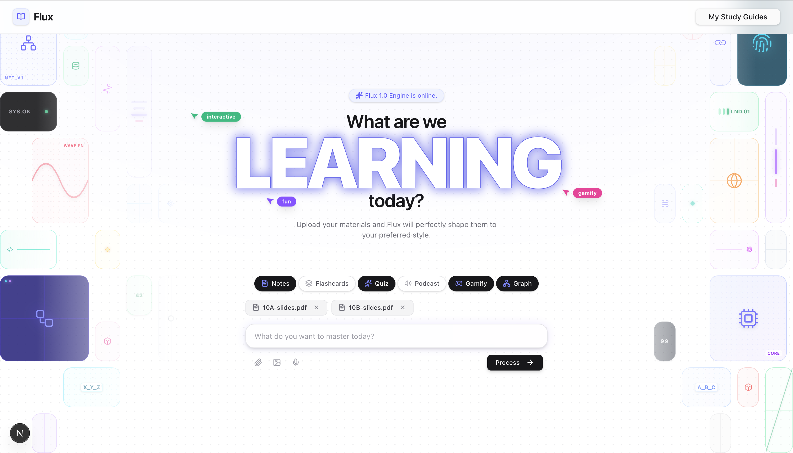
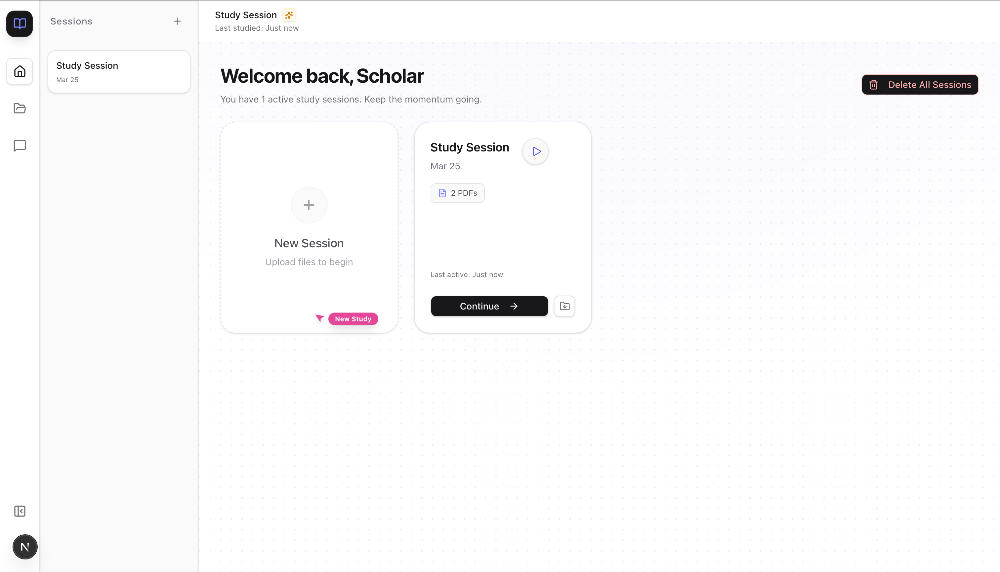
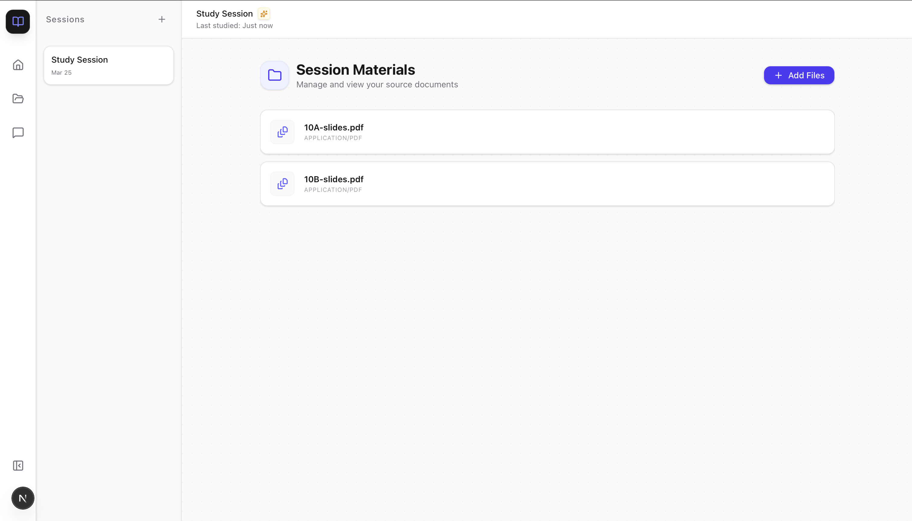
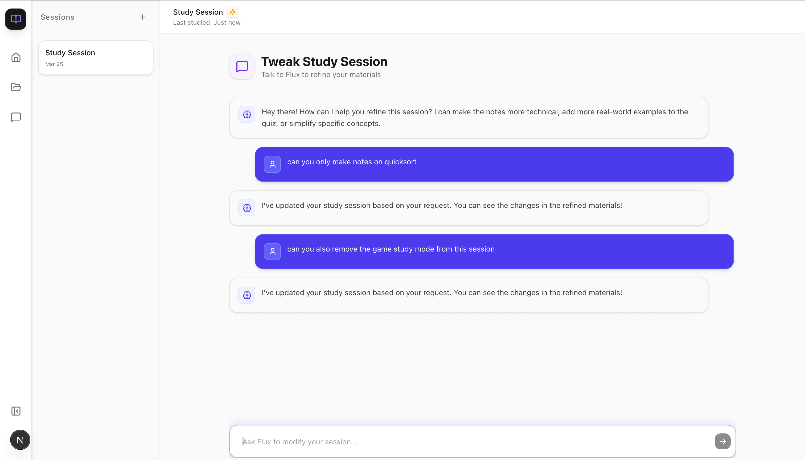
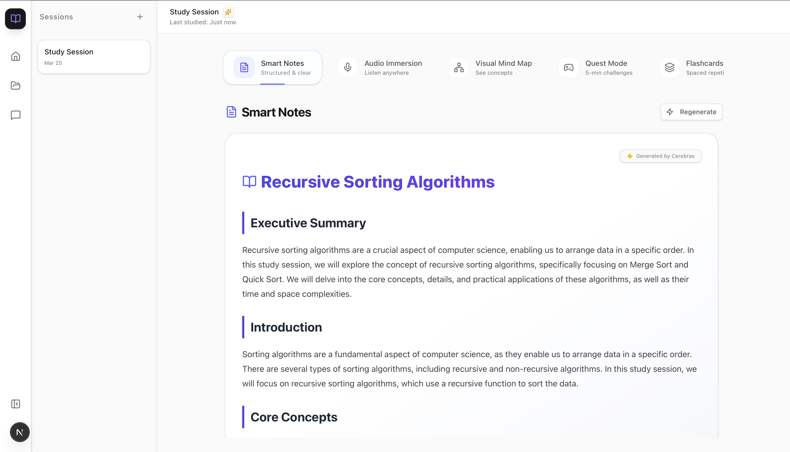
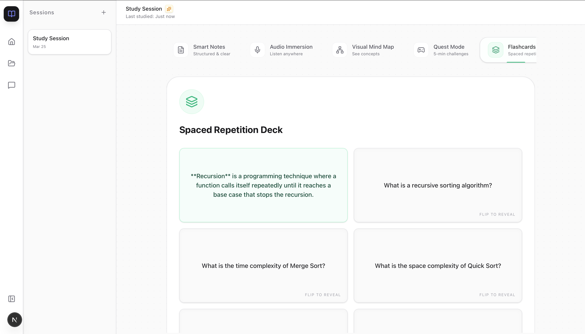

# Flux AI Learning Studio

> **Flux** is a Next.js app for AI-powered learning sessions that adapt your uploaded source materials into notes, flashcards, quizzes, podcasts, interactive quests, and visual maps.

<!-- TODO: Add screenshots below -->

## 📸 Screenshots

### Landing Page


### Session Dashboard




### Study Modes



### Quest Gameplay


---

## 🚀 Project Overview

Flux lets learners upload documents, images, audio/video, or enter topic text and instantly generate multi-modal study materials.

Key capabilities:

- Upload files using drag & drop or file picker
- Choose active learning modes: `notes`, `flashcards`, `quiz`, `podcast`, `quest`, `game`
- AI-powered session title generation and content extraction
- Session history and persistence via Prisma + SQLite (or configured DB)
- On-demand model generation via `/api/generate/[mode]` endpoints
- Graceful mock fallback if API keys are missing

---

## 🧩 Features

- Modern responsive UI (Tailwind + shadcn/ui + framer-motion)
- Attachments: PDF, audio, video, image
- Multi-mode output:
  - Notes with hierarchical Markdown structure
  - JSON-structured flashcards and quizzes
  - Narrative Quest storyline with choices
  - Mind map-style visual graph data
  - Podcast script / synthesized audio (ElevenLabs)
- Session CRUD:
  - Create sessions (`/api/sessions` POST)
  - List sessions (`/api/sessions` GET)
  - Delete one/all sessions (`/api/sessions/[id]` and DELETE)
- Optional image generation (Replicate/Pollinations)

---

## 🛠️ Tech Stack

- Next.js 16 (App Router)
- React 19
- TypeScript
- Prisma (SQLite by default)
- Zustand (state store)
- Cerebras SDK (LLM), ElevenLabs (TTS)
- Tailwind CSS v4 + shadcn components

---

## ⚙️ Setup

1. Clone repo

```bash
git clone <repo-url>
cd 'flux'
```

2. Install dependencies

```bash
npm install
# or pnpm install
```

3. Copy `.env.local` from template and set keys

```bash
cp .env.local.example .env.local
```

4. Update environment variables (set at least `DATABASE_URL`, `CEREBRAS_API_KEY`, `ELEVENLABS_API_KEY` for full behavior)

5. Run Prisma migrations

```bash
npx prisma migrate dev
```

6. Start dev server

```bash
npm run dev
```

7. Open http://localhost:3000

---

## 🧾 Environment Variables

Add these to `.env.local`:

- `DATABASE_URL` (e.g. `file:./prisma/dev.db`)
- `CEREBRAS_API_KEY` (Flux AI reasoning/generation)
- `ELEVENLABS_API_KEY` (audio synthesis)
- `REPLICATE_API_TOKEN` (optional images)
- `OPENAI_API_KEY` (fallback/extra features)
- `PINECONE_API_KEY`, `PINECONE_ENVIRONMENT` (if vector search is enabled)

> The existing `.env.local` in repository has placeholders and sample values, but please do not commit real secrets.

---

## 🧪 Running Tests

No dedicated test suite is included yet. Use the app manually:

1. Create session with topic and file attachments
2. Verify `/loading` path triggers generation
3. Run each mode output in dashboard

---

## 🗂 Project Structure

- `src/app/` – Next.js routing, pages, API endpoints
- `src/components/` – UI components and mode-specific renderers
- `src/lib/` – business logic (`ai.ts`, `fileParser.ts`, `store.ts`, `prisma.ts`)
- `prisma/` – schema, migrations

---

## ✅ Common Workflows

1. Start on landing page
2. Input a topic or upload files
3. Pick one or more modes
4. Hit Start Session
5. Wait on `/loading` while AI generates content
6. Explore session in `/dashboard/session/[id]`

---

## 🛡️ Notes

- If an external service key is missing, Flux falls back to mock content for stability.
- Session metadata fields include counts for PDFs/audio/video/image and render the current active mode.

---

## 🙌 Contributing

1. Fork and create a feature branch
2. Add tests/validate UI flows
3. Open PR with changes and screenshots
